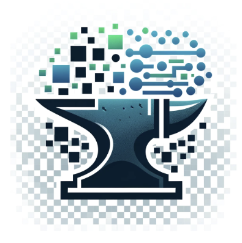

# Welcome to My GitHub Profile! 🚀

👋 Hi, I'm @TabithaSW.

## About Me

- 👀 I'm passionate about **Data Science, Web and App Development, Statistical Analysis, Machine Learning, and Video Games!**.
- 🎓 I am an MSU graduate with a bachelor's degree in **Data Science** as of May, 2023.
- 🌱 Skilled in **Python, C++, SQL, and R**, and familiar with **Flask** and **Django** frameworks.
- 💞️ Looking to collaborate on **Software Development, Game Design**, or **Data Science Projects.**

### Data Forge Fusion

 

**Data Forge Fusion** is a versatile toolkit designed for **data conversion, cleaning, analysis, and visualization**. It supports various file formats including XML, CSV, Parquet, Excel, and JSON, allowing for seamless conversions. With integrated features like data previewing, merge capabilities, file compression, detailed data summaries, duplicate detection, and custom plot creation, it simplifies data manipulation tasks, making it a go-to application for data enthusiasts.

## Collaboration and Contact

- 💼 I’m looking to collaborate on **Software Development, Game Design**, or **Data Science projects**.
- 📫 How to reach me: Email me at tabithaweinbrenner@gmail.com!

Let's connect and collaborate on exciting projects together! 🌟
